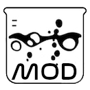

<div style="text-align:center">

<h1>Bonelab Mod Manager</h1>
BLMM is a CLI app which allows you to create custom mod profiles in Bonelab for Traditional Map/Weapon Mods.
<b>This is not for code mods.</b>
</div>

## Running
### Binaries
Download the .exe from the [releases](https://github.com/RedBigz/bonelabmm/releases) and run it.
### From source
See [the compiling section](#compiling) if you want to contribute or build it yourself.

## Compiling
First, clone the repo.

```sh
git clone https://github.com/RedBigz/bonelabmm
```

Then, create a venv and install the requirements.

```sh
python -m venv .venv
pip install -r requirements.txt
```

### Make (Recommended)

Run `make`.
```sh
make
```

A `blmm.exe` should appear in the root directory of the repo.

Then you can run `make clean` to clean the `dist` and `build` directories, along with removing the spec files.

### PyInstaller

Run `pyinstaller` to create the executable.

```sh
pyinstaller --icon=res/icon.ico --onefile main.py
```